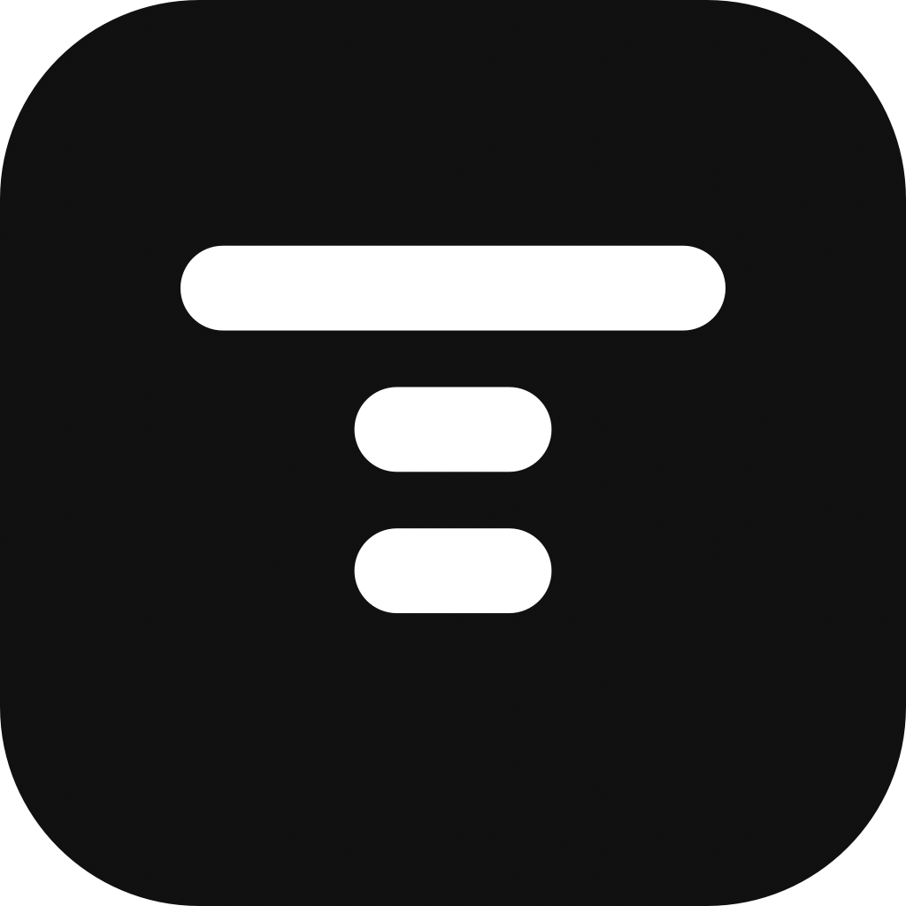

# Topside

<p align="center">
  
</p>

Topside is a native macOS 14+ menu-bar status light for exactly five local coding agents: **Codex, Claude Code, Cursor Agent, OpenCode, and Pi**. It shows when work is running, waiting, or finished without becoming another agent dashboard.

Topside uses event-driven local hooks. A hook sends a minimal lifecycle event to a user-only Unix socket. Topside does not scrape transcripts, infer status from processes, or sync data to the cloud.

## Product identity and rename

The product was renamed from Atoll to Topside because another product used the Atoll name for similar functionality. The product, app bundle, executable, managed integrations, and app-owned state use **Topside**. The repository URL remains [`Givdul/atoll`](https://github.com/Givdul/atoll) for continuity with existing issues, links, release feeds, and update metadata.

See [Product identity](PRODUCT_IDENTITY.md) for the permanent identity and legacy migration boundary.

## Use cases

- See the state of supported coding-agent sessions from the macOS menu bar.
- Notice when an agent needs input or permission without reading its transcript.
- Return to the originating macOS application when the hook provides an app identity.
- Keep lifecycle data and delivery queues local while agents run.
- Diagnose and repair supported user-level hooks without changing unrelated configuration.

## Key capabilities

- **Typed lifecycle states.** `started` shows a running session. `finished`, `failed`, and `cancelled` end it. `needsInput` and `needsPermission` remain distinct attention states.
- **Reliable local delivery.** Events are written to JSON queues under `~/.topside` before the sender is acknowledged. Topside removes an event only after it persists the resulting state. Replay is safe, and duplicate terminal events do not extend display time.
- **Bounded status display.** Active events expire after ten minutes of local inactivity. Terminal rows receive a local dwell. Retained tombstones suppress late cleanup events and repeated completion notifications.
- **Optional notifications.** Native notifications are off by default. When enabled, they cover new input, approval, and failure transitions only when the originating app is not frontmost.
- **Click-to-return.** Topside can reactivate the captured app process, or use the same bundle identifier after an app restart. Headless sessions remain non-interactive. Topside does not navigate to a thread, window, tab, or pane.
- **Local setup and diagnostics.** Provider Connections checks detection, integration content, the private bridge, visible managed-policy blocking, the app socket, and the last valid event separately. Repair and Remove act only after you select the provider-specific action.

Provider clocks are used for ordering only after future-skew clamping. They cannot keep a session alive or make a delayed terminal disappear instantly. Recovery restores project and state only, then waits for a fresh live title or prompt. The runtime doctor retains only each provider identity and its latest valid local event time after ordinary session expiry. The shared local lifecycle queue retains at most 256 events, including when Topside is not running.

## Native hook integrations

Topside offers setup on first launch only when it detects a supported agent that is not already configured. It installs user-level integrations for:

- **Codex:** `UserPromptSubmit` and `Stop`
- **Claude Code:** `UserPromptSubmit`, `Stop`, `StopFailure`, and typed permission/input notifications
- **Cursor Agent:** `beforeSubmitPrompt` and `stop`
- **OpenCode:** a global plugin for session status/error, session titles, latest user text, and permission/question events
- **Pi 0.80.4 or newer:** a global TypeScript extension using `before_agent_start`, `agent_start`, `agent_end`, and `agent_settled`

The installer preserves existing settings and hooks. It verifies the exact managed integration, bridge contents, and bridge permissions after writing. Static verification does not prove runtime activation. Codex may require `/hooks` review. Extensions and plugins may need a reload or a new session. Topside honors documented inherited custom user homes for Codex, Claude Code, OpenCode, and Pi, while leaving project and policy layers untouched.

See [Live Status Support](LIVE_STATUS_SUPPORT.md) for the source-linked event contract, state fidelity, activation requirements, and release limitations.

Existing installs migrate known app-owned state and defaults once using Topside, then Skerry, then Atoll precedence. Migration does not overwrite Topside data or delete either legacy tree. Repair recognizes exact Topside-, Skerry-, and Atoll-owned integrations for all five providers and replaces only verified entries.

The supported harnesses can also send the normalized protocol through the Topside executable:

```sh
printf '%s' '{"session_id":"session-123","cwd":"/path/to/project"}' \\
  | /Applications/Topside.app/Contents/MacOS/Topside --lifecycle-event codex started
```

Use `finished`, `failed`, `cancelled`, `needsInput`, or `needsPermission` for the corresponding transition. `input_required` and `input-required` are accepted aliases for `needsInput`.

For an isolated queue smoke test that does not touch normal Topside state or provider configuration:

```sh
TEST_HOME="$(mktemp -d)"
printf '%s' '{"session_id":"isolated","cwd":"/tmp/project"}' \\
  | CFFIXED_USER_HOME="$TEST_HOME" .build/debug/Topside \\
      --lifecycle-event codex started
find "$TEST_HOME/.topside/lifecycle-events" -name '*.json' -type f
rm -rf "$TEST_HOME"
```

## Privacy and lifecycle data

Topside retains only the agent provider, provider session ID, normalized state, provider and local ordering/delivery timestamps, a project-folder label, and the complete originating process-ID/bundle-ID pair used for click-to-return. A bounded task label can appear in the live in-memory row. Delivery identities are Topside-generated IDs or SHA-256 digests for replay deduplication.

Hook payloads can include prompts or other content on standard input. Topside normalizes only a short task label for the live socket and UI. Raw content never enters canonical socket JSONL, durable queues, the registry, logs, notifications, or uploads. Prompts, responses, commands, transcripts, diffs, environment values, model identifiers, and full working-directory paths are discarded. The project label uses only the working directory's final component.

Topside has no analytics, crash reporting, advertising, telemetry, or cloud synchronization. Lifecycle data stays on the Mac. Network access is limited to Polar license actions and periodic validation, plus the configured Sparkle update feed in production builds.

See [Privacy Policy](PRIVACY.md) for the complete local-data and network boundaries.

## Technology stack

- **Platform:** native macOS 14+
- **Language:** Swift 6
- **UI:** SwiftUI and AppKit
- **Build system:** Swift Package Manager
- **Updates:** Sparkle 2.9.4 or newer
- **Local transport:** user-only Unix socket
- **Local persistence:** owner-only JSON files and event queues under `~/.topside`
- **Licensing:** Keychain-backed production entitlement with Polar validation
- **Distribution:** universal `arm64` + `x86_64` direct-download app build

## Licensing and purchase

The documented product license is a **$7.99 one-time Polar license** with one 72-hour trial and no account or subscription. The license is perpetual with no activation or usage limit. Release builds store license material in the macOS Keychain and validate at most daily. Network failures do not remove previously validated access.

Ad-hoc development builds do not read or save license material and never query Keychain. After trial or license expiry, production Topside hides product output and notifications while hooks continue to acknowledge events quickly.

See [Licensing](LICENSING.md) and the [license and sale terms](TERMS.md). The repository source is proprietary under the [source code notice](LICENSE); bundled dependencies retain their own licenses.

## Build and test

Run the same checks as CI:

```sh
swift build --product Topside
swift test
./Scripts/test-lifecycle-queue-concurrency.sh
```

Build and install the universal local app:

```sh
./Scripts/build-release.sh --install
```

The release script builds and verifies a universal `arm64` + `x86_64` bundle, signs embedded Sparkle components inside-out, and installs `/Applications/Topside.app` with rollback on failure. Local builds use an ad-hoc signature by default. Distribution requires a Developer ID identity, Apple notarization credentials, and Sparkle feed credentials described by the script and [Releasing Topside](RELEASING.md).

## Icon reference

[`docs/assets/topside-icon.png`](docs/assets/topside-icon.png) is a PNG representation of the canonical [`Bundle/Topside.icns`](Bundle/Topside.icns). It uses the shipped icon without visual redesign and is suitable for GitHub README rendering and reuse by the separate zones-web landing-page project.

## Related documentation

- [Product identity](PRODUCT_IDENTITY.md)
- [Live Status Support](LIVE_STATUS_SUPPORT.md)
- [Privacy Policy](PRIVACY.md)
- [Licensing](LICENSING.md)
- [Releasing Topside](RELEASING.md)
- [Support tracker](https://github.com/Givdul/atoll/issues)
- [Source code notice](LICENSE)
